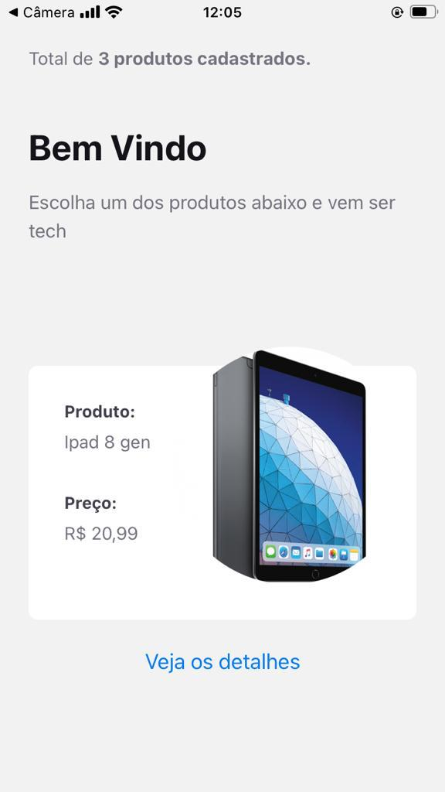
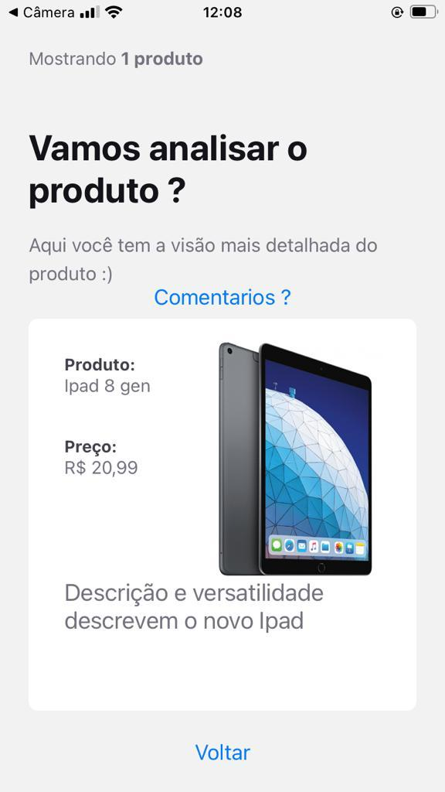
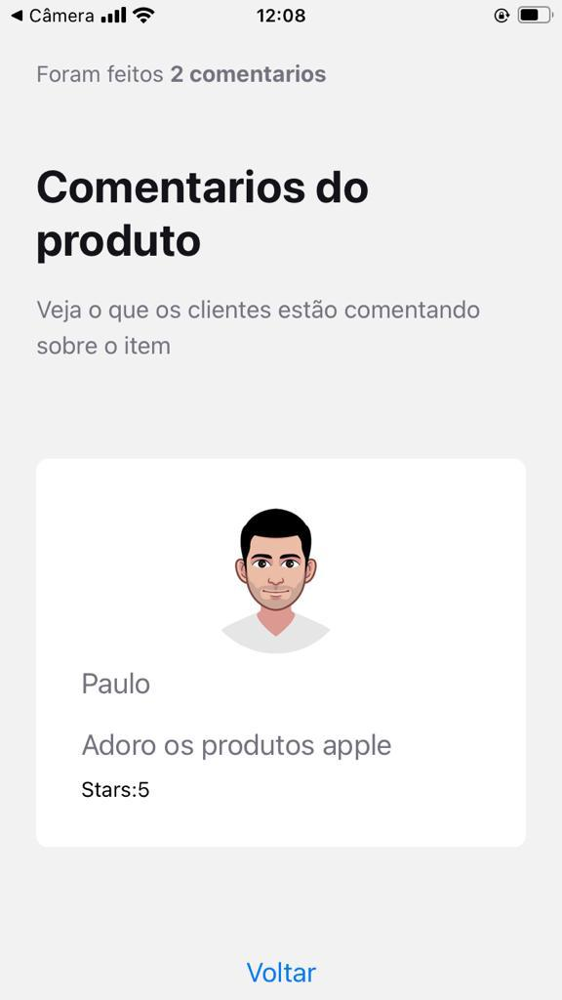

# MiniStore-MobileApp
## _Aplicação feita usando o ReactNative/Expo_
### Essa é a pagina inicial do projeto



Nela temos a listagem de todos os produtos cadastrados no backend que são chamados via Axios :)
### Próxima tela :
Apos escolher um produto você pode clicar no botão de detalhes para visualizar melhor o seu produto , usando o Nagivation Stack essa tela vai aparecer :
## 



Veja que nela temos a opção de voltar para a pagina inicial e a opção de comentarios , para visualizar o que os clientes estão comentando sobre aquele produto , então vamos a pŕoxima :
### Comentários :) 



Aqui é a tela final do app , nela temos uma listagem mostrando todos os comentarios feitos sobre aquele item.
#### Detalhes :
* Todas as telas tem um contator de registros na parte superior 
* Verifique sempre as suas configurações de rede para execução desse projeto , visto que é uma aplicação expo que não foi compliada em .apk e nem .ipa
# Executando o projeto :
Faça o clone desse repositorio , consulte o README do backend e inicialize .
com o backend iniciado entre no diretorio "mobile" e execute :
```
yarn install 
```
para instalação das dependencias do projeto .
com tudo baixado vamos executar o expo usando a sua propia CLI:
```
expo start
```
com isso o projeto vai ser iniciado , e será mostrada em tela o QR code para que seja lido por seu aparelho .
#### Observação :
Preste atenção no IP da sua máquina e porta que o backend está executando , o arquivo deve ser alterado para o seu IP e sua porta escolhida para rodar o projeto na sua máquina , arquivo de configuração está localizado em :
```
/mobile/src/services/api.js
```


### Tecnologias usadas :
* Expo
* ReactNative
* JS
* Axios

